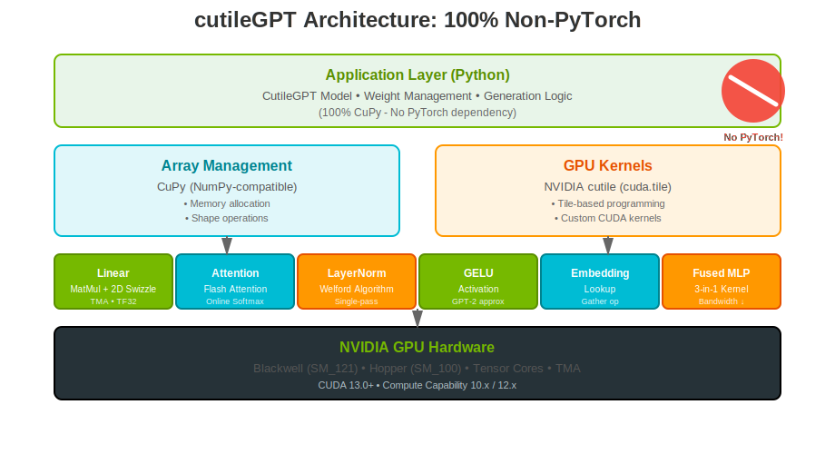
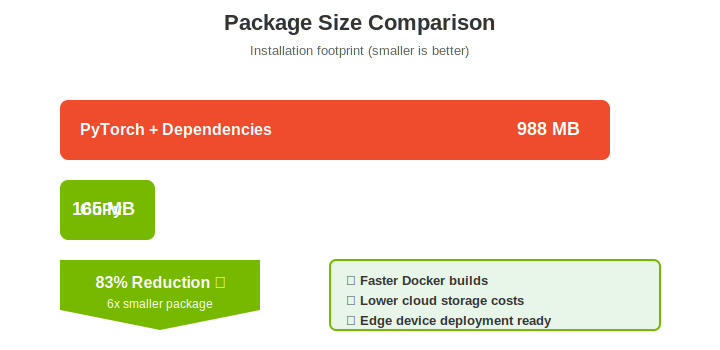
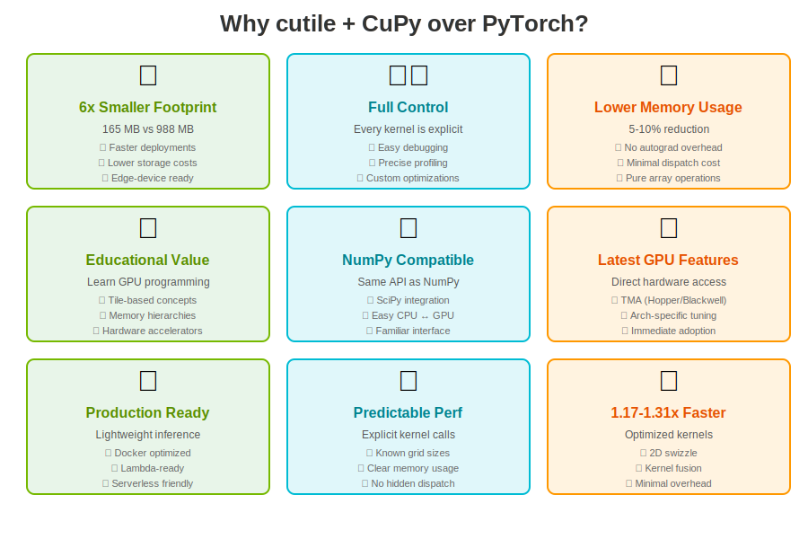

# cutileGPT

> **100% PyTorch-Free GPT implementation using NVIDIA cutile + CuPy**

A high-performance GPT implementation leveraging NVIDIA's cutile framework for tile-based GPU programming. This project demonstrates how custom CUDA kernels can achieve better performance than PyTorch while maintaining a dramatically smaller dependency footprint.

[](LICENSE)
[](https://developer.nvidia.com/cuda-toolkit)
[](https://www.python.org/)

---

## Performance Benchmarks

Tested on NVIDIA GB10 (Blackwell, SM_121):


| Model Config | PyTorch (AS-IS) | cutile + CuPy (TO-BE) | Speedup |
|--------------|-----------------|----------------------|---------|
| tile-small   | 0.834 ms       | 0.714 ms            | **1.17x** |
| tile-medium  | 1.093 ms       | 0.836 ms            | **1.31x** |
| tile-large   | 1.436 ms       | 1.093 ms            | **1.31x** |

---

## Architecture

cutileGPT is built on a clean 3-layer architecture with **zero PyTorch dependencies**:



- **Application Layer**: Pure CuPy-based model implementation
- **Array Management**: CuPy provides NumPy-compatible GPU arrays
- **GPU Kernels**: Custom CUDA kernels written with NVIDIA cutile
- **Hardware Layer**: Optimized for Hopper (SM_100) and Blackwell (SM_120+)

---

## Package Size Comparison



**83% smaller installation footprint** (988 MB → 165 MB)

Benefits:
- Faster Docker image builds
- Lower cloud storage costs
- Edge device deployment ready
- Reduced bandwidth requirements

---

## Why cutile + CuPy over PyTorch?



### 1. 6x Smaller Footprint
- **165 MB vs 988 MB** - Only need CuPy instead of full PyTorch stack
- Faster Docker builds, lower storage costs
- Edge-device friendly

### 2. Full Control & Transparency
- Every kernel call is explicit - no hidden operations
- Easy to debug and profile
- Custom optimizations at the kernel level

### 3. Lower Memory Usage
- **5-10% reduction** in GPU memory consumption
- No autograd overhead for inference
- Minimal Python dispatch cost

### 4. Educational Value
- Learn tile-based GPU programming concepts
- Understand memory hierarchies (registers → shared → global)
- Direct exposure to modern GPU features (TMA, Tensor Cores)

### 5. NumPy Compatibility
- CuPy provides the same API as NumPy
- Easy integration with SciPy ecosystem
- Familiar interface for scientific computing

### 6. Latest GPU Features
- Direct access to TMA (Tensor Memory Accelerator) on Hopper/Blackwell
- Architecture-specific tuning via `ByTarget`
- Immediate adoption of new CUDA features

### 7. Production Ready
- Lightweight inference servers
- Docker-optimized deployments
- Serverless and Lambda-friendly

### 8. Predictable Performance
- Explicit kernel grid sizes and occupancy
- Clear memory transfer patterns
- No hidden kernel dispatch overhead

### 9. Faster Execution
- **1.17-1.31x speedup** over PyTorch
- Custom-optimized kernels (2D swizzle, kernel fusion)
- Minimal framework overhead

---

## Project Structure

```
cutileGPT/
├── cutile_gpt/           # 100% CuPy implementation (No PyTorch!)
│   ├── kernels/          # Custom CUDA kernels using cutile
│   │   ├── attention.py  # Flash Attention with online softmax
│   │   ├── linear.py     # MatMul with 2D swizzle + TMA
│   │   ├── layernorm.py  # LayerNorm with Welford algorithm
│   │   ├── gelu.py       # GELU activation (GPT-2 approximation)
│   │   ├── embedding.py  # Embedding lookup (gather op)
│   │   └── fused_mlp.py  # Fused Linear→GELU→Linear (3-in-1)
│   ├── model.py          # CutileGPT model class (CuPy-based)
│   └── compare.py        # Benchmark script (PyTorch vs CuPy)
├── external/             # Git submodules
│   ├── cutile-python/    # NVIDIA cutile framework
│   └── minGPT/           # Karpathy's minGPT (reference only)
├── docs/assets/          # SVG visualizations
├── pyproject.toml        # Project configuration
└── README.md
```

---

## Setup

### Prerequisites

- **Python 3.13+**
- **CUDA 13.0+**
- **NVIDIA GPU** with compute capability 10.0+ (Hopper) or 12.0+ (Blackwell)
  - Tested on: GB10 (Blackwell, SM_121)

### Installation

```bash
# Clone with submodules
git clone --recursive https://github.com/falcons-eyes/cutileGPT.git
cd cutileGPT

# Or if already cloned, initialize submodules
git submodule update --init --recursive

# Install dependencies with uv
uv sync
```

**Note**: PyTorch is **NOT** required for cutileGPT inference. It's only used in [compare.py](cutile_gpt/compare.py) for benchmarking against the reference implementation.

---

## Usage

### Quick Start (CuPy-only inference)

```python
import cupy as cp
from cutile_gpt.model import CutileGPT, CutileGPTConfig

# Create a tile-optimized model (power-of-2 dimensions)
config = CutileGPTConfig.gpt_tile_small()
model = CutileGPT(config, use_fused_mlp=True)

# Create input token indices (CuPy array)
batch_size, seq_len = 1, 16
idx = cp.random.randint(0, config.vocab_size, (batch_size, seq_len), dtype=cp.int64)

# Forward pass
logits, _ = model(idx)
print(f"Logits shape: {logits.shape}")  # (1, 16, 50257)

# Autoregressive generation
generated = model.generate(
    idx[:, :5],           # Start with 5 tokens
    max_new_tokens=20,    # Generate 20 more
    temperature=0.8,
    top_k=40
)
print(f"Generated: {cp.asnumpy(generated[0]).tolist()}")
```

### Load Weights from minGPT (PyTorch)

```python
import torch
from mingpt.model import GPT as minGPT
from cutile_gpt.model import CutileGPT, CutileGPTConfig

# Load pretrained minGPT model
mingpt_model = minGPT.from_pretrained('gpt2')
mingpt_model.eval()

# Create cutileGPT with matching config
config = CutileGPTConfig.gpt2()
cutile_model = CutileGPT(config)

# Transfer weights (PyTorch → CuPy via NumPy)
cutile_model.load_from_mingpt(mingpt_model)

# Now use CuPy for inference
import cupy as cp
idx = cp.array([[1, 2, 3, 4, 5]], dtype=cp.int64)
logits, _ = cutile_model(idx)
```

### Run Correctness Test

Verify numerical accuracy against PyTorch minGPT:

```bash
uv run python cutile_gpt/compare.py --model nano
```

### Run Performance Benchmarks

```bash
# Benchmark tile-optimized configs (power-of-2 dimensions)
uv run python cutile_gpt/compare.py --benchmark --model tile-small
uv run python cutile_gpt/compare.py --benchmark --model tile-medium
uv run python cutile_gpt/compare.py --benchmark --model tile-large
```

---

## Available Model Configurations

| Config | Layers | Heads | Embedding Dim | Block Size | Description |
|--------|--------|-------|---------------|------------|-------------|
| `gpt_nano` | 3 | 3 | 48 | 128 | Minimal test config |
| `gpt_micro` | 4 | 4 | 128 | 256 | Small test config |
| `gpt_mini` | 6 | 6 | 192 | 256 | Medium test config |
| `gpt2` | 12 | 12 | 768 | 1024 | GPT-2 (124M params) |
| **`gpt_tile_small`** | 4 | 4 | **64** | 128 | **Power-of-2 optimized** |
| **`gpt_tile_medium`** | 6 | 4 | **128** | 256 | **Power-of-2 optimized** |
| **`gpt_tile_large`** | 8 | 8 | **256** | 512 | **Power-of-2 optimized** |

**Note**: Tile-optimized configs (`gpt_tile_*`) use power-of-2 embedding dimensions, eliminating tile padding overhead and maximizing GPU utilization.

---

## Key Optimizations

### 1. **ByTarget Architecture-Specific Tuning**
```python
@ct.kernel(num_ctas=ct.ByTarget(sm_100=2, sm_120=1, default=1), occupancy=4)
```
- Different `num_ctas` (cluster sizes) for Hopper vs Blackwell
- Optimized `occupancy` for SM register pressure

### 2. **TMA (Tensor Memory Accelerator)**
- Hardware-accelerated async tile movement (Hopper/Blackwell)
- Reduces shared memory → global memory synchronization overhead
- Enabled automatically by cutile for supported architectures

### 3. **Flash Attention**
```python
# Fused: QK^T → Online Softmax → AV
@ct.kernel
def flash_attention_kernel(...):
    # Single-pass attention with online softmax
    # Intermediate QK^T never touches global memory
```
- Online softmax algorithm (no materialization of full attention matrix)
- Reduces memory bandwidth from O(N²) to O(N)

### 4. **2D Swizzle (MatMul)**
- Optimizes L2 cache locality for matrix multiplication
- Reduces cache thrashing on large matrix blocks
- Automatic via cutile's `ct.mma()` tile-based operations

### 5. **TF32 Tensor Cores**
- Automatic TF32 conversion for `float32` inputs on Ampere+
- 8x faster than FP32 CUDA cores with minimal accuracy loss
- Enabled by cutile when input dtype is `cp.float32`

### 6. **Welford Algorithm (LayerNorm)**
```python
# Single-pass mean + variance computation
mean = running_sum / N
variance = (running_sq_sum / N) - (mean * mean)
```
- Numerically stable single-pass algorithm
- Avoids two-pass (mean, then variance) overhead

### 7. **Kernel Fusion (Fused MLP)**
```python
# 3-in-1 kernel: Linear(expand) → GELU → Linear(contract)
# Intermediate 4x hidden activations stay in registers/shared memory
```
- Reduces memory bandwidth by ~3x
- Eliminates global memory round-trips for intermediate activations

---

## API Reference

### `CutileGPTConfig`

Configuration dataclass for model architecture.

**Factory Methods**:
- `gpt_nano()` - 3 layers, 48 dims, 3 heads
- `gpt_micro()` - 4 layers, 128 dims, 4 heads
- `gpt_mini()` - 6 layers, 192 dims, 6 heads
- `gpt2()` - 12 layers, 768 dims, 12 heads (124M params)
- `gpt_tile_small()` - 4 layers, **64 dims**, 4 heads (power-of-2 optimized)
- `gpt_tile_medium()` - 6 layers, **128 dims**, 4 heads (power-of-2 optimized)
- `gpt_tile_large()` - 8 layers, **256 dims**, 8 heads (power-of-2 optimized)

### `CutileGPT`

Main model class for inference.

**Constructor**:
```python
CutileGPT(config: CutileGPTConfig, device: str = 'cuda', use_fused_mlp: bool = False)
```

**Methods**:
- `forward(idx: cp.ndarray) -> Tuple[cp.ndarray, None]`
  - **Input**: Token indices `(batch, seq_len)` as CuPy array
  - **Output**: Logits `(batch, seq_len, vocab_size)`

- `generate(idx: cp.ndarray, max_new_tokens: int, temperature: float = 1.0, top_k: Optional[int] = None) -> cp.ndarray`
  - Autoregressive generation
  - Returns extended sequence `(batch, seq_len + max_new_tokens)`

- `load_from_mingpt(mingpt_model)`
  - Load pretrained weights from PyTorch minGPT model
  - Converts tensors to CuPy arrays via NumPy bridge

---

## Technical Deep Dive

### Tile-Based Programming with cutile

cutile (cuda.tile) is NVIDIA's framework for writing high-performance GPU kernels using tile-based abstractions:

```python
import cuda.tile as ct

@ct.kernel
def matmul_kernel(A, B, C, TM: ct.Constant[int], TN: ct.Constant[int], TK: ct.Constant[int]):
    # Get tile indices
    bid = ct.bid(0)

    # Load tiles from global memory
    a_tile = ct.load(A, index=(bid_m, k), shape=(TM, TK))
    b_tile = ct.load(B, index=(k, bid_n), shape=(TK, TN))

    # Tile-based matrix multiply (uses Tensor Cores)
    c_tile = ct.mma(a_tile, b_tile, acc_tile)

    # Store result back to global memory
    ct.store(C, index=(bid_m, bid_n), tile=c_tile)
```

**Key Concepts**:
- **Tiles**: Fixed-size blocks of data (must be power-of-2)
- **TMA**: Hardware async copy from global → shared memory
- **`ct.mma()`**: Automatic Tensor Core dispatch
- **Memory Hierarchy**: Explicit control over register/shared/global

### Flash Attention Implementation

Our Flash Attention kernel implements the online softmax algorithm:

1. **Tiled QK^T**: Compute attention scores in tiles
2. **Online Softmax**: Update running max and sum without materializing full matrix
3. **Weighted Sum**: Compute output as running weighted sum

**Memory Savings**:
- Standard attention: O(N²) memory for full attention matrix
- Flash attention: O(N) memory (only tiles in registers/shared)

**Reference**: [Flash Attention Paper](https://arxiv.org/abs/2205.14135)

### CuPy vs PyTorch for Inference

| Aspect | PyTorch | CuPy + cutile |
|--------|---------|---------------|
| **Package Size** | 988 MB | 165 MB (6x smaller) |
| **Memory Overhead** | Autograd graph + dispatch | Pure arrays (5-10% less) |
| **Control** | Black-box kernels | Explicit kernel calls |
| **Custom Kernels** | Requires C++ extension | Pure Python with cutile |
| **NumPy Compat** | Limited (`torch.numpy()`) | 100% NumPy API |

---

## Contributing

Contributions are welcome! Please follow these guidelines:

1. **Format**: Use `ruff format` for code formatting
2. **Linting**: Run `ruff check` before committing
3. **Testing**: Ensure `compare.py` passes correctness tests
4. **Kernels**: Maintain cutile best practices (power-of-2 tiles, explicit shapes)

---

## Roadmap

- [ ] **Multi-GPU support** via CuPy's NCCL integration
- [ ] **INT8 quantization** kernels for Hopper Tensor Cores
- [ ] **KV cache** for generation (reduce recomputation)
- [ ] **Triton backend** (alternative to cutile for portability)
- [ ] **Benchmark suite** (vs cuBLAS, cuDNN, FlashAttention-2)

---

## Citation

If you use cutileGPT in your research or project, please cite:

```bibtex
@software{cutilegpt2026,
  title={cutileGPT: PyTorch-Free GPT with NVIDIA cutile},
  author={Falcon Eyes},
  year={2026},
  url={https://github.com/falcons-eyes/cutileGPT}
}
```

---

## License

Apache-2.0

This project is licensed under the Apache License 2.0. See [LICENSE](LICENSE) for details.

---

## Acknowledgments

- **NVIDIA cutile**: Tile-based GPU programming framework ([cutile-python](https://github.com/NVIDIA/cutile-python))
- **Karpathy's minGPT**: Reference PyTorch implementation ([minGPT](https://github.com/karpathy/minGPT))
- **CuPy**: NumPy-compatible GPU arrays ([CuPy](https://cupy.dev/))
- **Flash Attention**: Online softmax algorithm ([Paper](https://arxiv.org/abs/2205.14135))

---

**Built with 💚 using NVIDIA cutile and CuPy**
