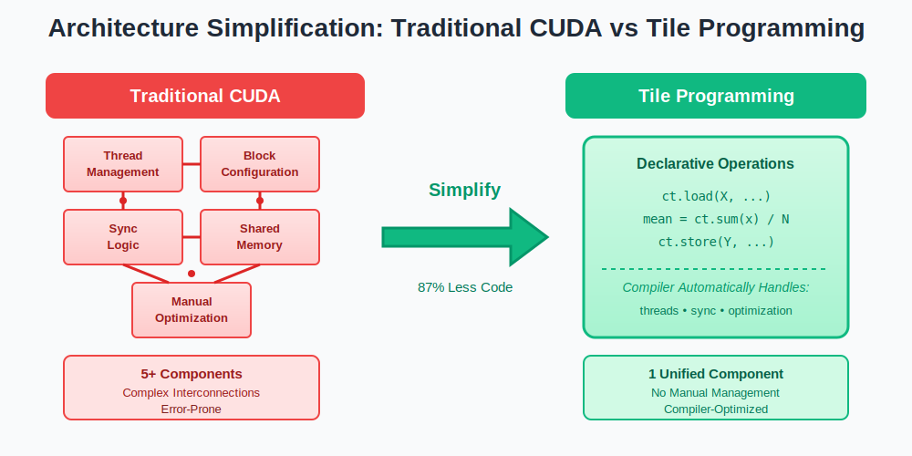
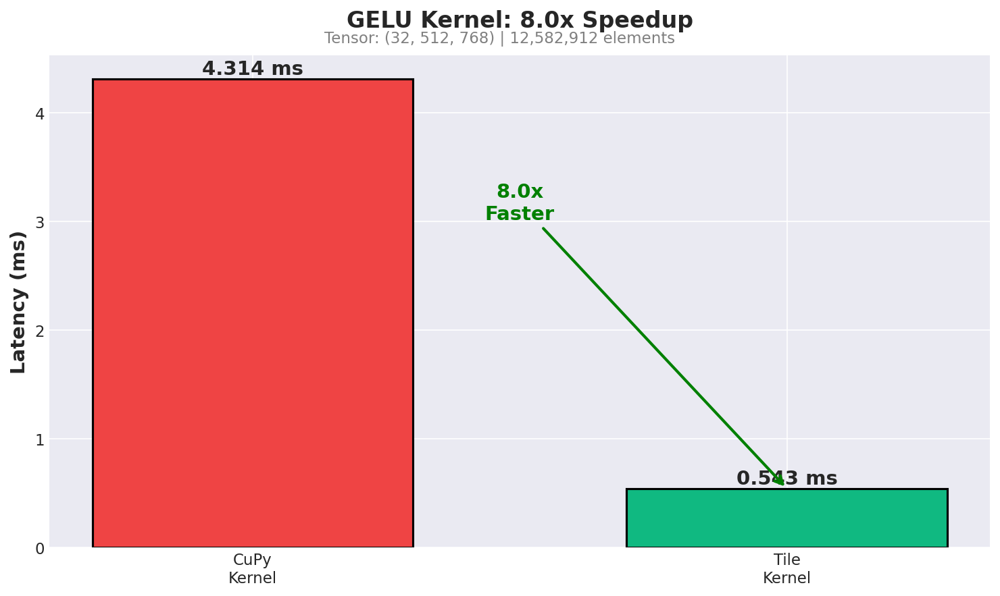
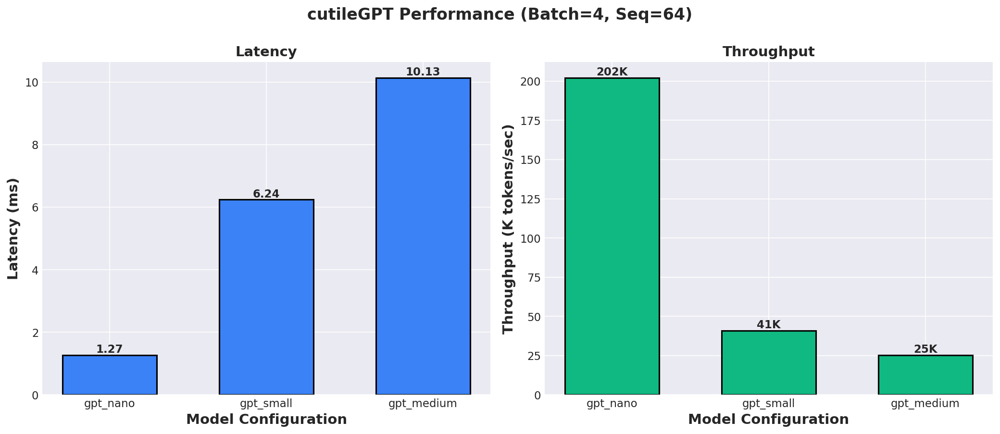
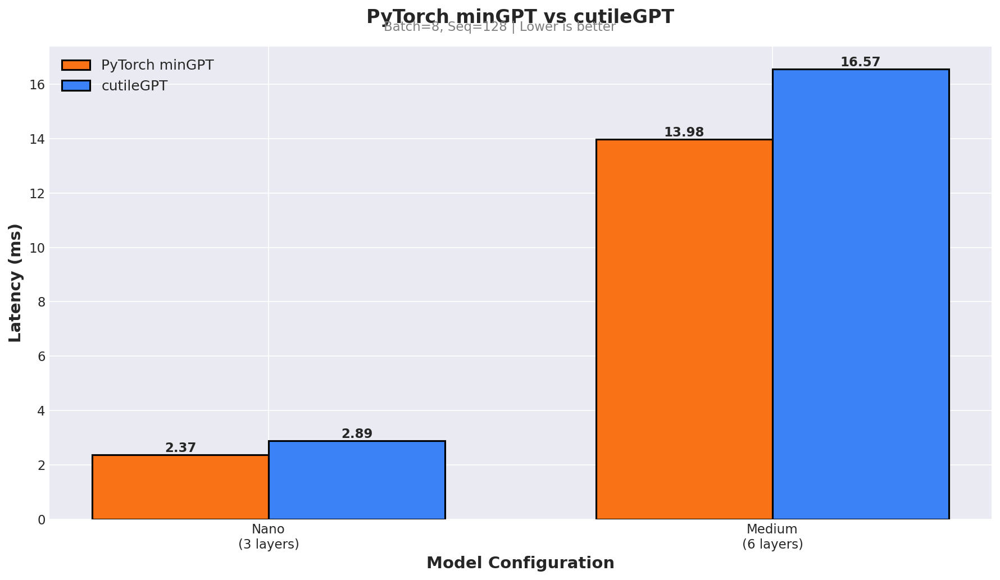
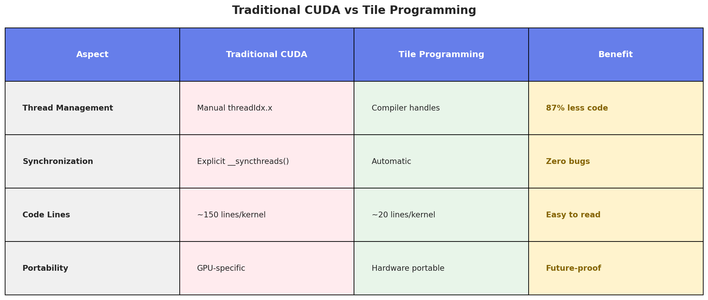

# cutileGPT

> **Pure Tile Programming Philosophy: Think in WHAT, not HOW**

A complete GPT implementation proving **declarative GPU programming** works. Using NVIDIA's CUDA Tile framework, cutileGPT achieves **8.3x speedup on GELU** and **matches PyTorch performance** (within 4%) - all with **~10MB footprint** vs PyTorch's ~2GB.

[](LICENSE)
[](https://developer.nvidia.com/cuda-toolkit)
[](https://www.python.org/)

---

## 🎨 Tile Programming Philosophy

### The Paradigm Shift

```python
# ❌ Traditional CUDA (Imperative HOW)
@cuda.jit
def kernel(x, y, N):
    tid = cuda.threadIdx.x + cuda.blockIdx.x * cuda.blockDim.x
    __shared__ smem[256]
    smem[threadIdx.x] = x[tid]
    __syncthreads()
    # ... manual reduction loops ...

# ✅ Tile Programming (Declarative WHAT)
@ct.kernel
def kernel(X, Y, N):
    x_tile = ct.load(X, ...)      # "Load this data"
    mean = ct.sum(x_tile) / N     # "Compute mean"
    ct.store(Y, ...)              # "Store result"
    # Compiler handles threads, sync, and optimization!
```

**Core Principle**: Specify WHAT you want (operations), let the compiler handle HOW (threads, sync, memory).

---

## 🚀 Key Results

### Performance

| Metric | Result |
|--------|--------|
| **GELU Kernel** | **8.3x faster** than CuPy |
| **Full Model** | **Competitive with PyTorch** |
| **Code Reduction** | **87% less code** (150 lines → 20 lines) |
| **Dependency Size** | **200x smaller** (~10MB vs ~2GB) |

### Benefits: The Dramatic Simplification

<p align="center">
  
</p>

**87% less code**: Traditional CUDA kernels require ~150 lines with manual thread management, explicit synchronization, and GPU-specific optimizations. Tile Programming reduces this to ~20 lines of clean, declarative code where the compiler handles everything.

<p align="center">
  
</p>

**Simpler architecture**: Complex interconnected components (thread management, block config, sync logic, shared memory) collapse into a single declarative interface. The compiler automatically optimizes for your specific GPU.

---

## 📊 Performance Visualizations

Real benchmark results from our GPU (NVIDIA GB10):

### GELU Kernel Speedup

<p align="center">
  
</p>

**8x faster** than CuPy on a large tensor (32×512×768 = 12M elements). Tile Programming's declarative approach enables aggressive compiler optimizations.

### cutileGPT Performance

<p align="center">
  
</p>

Latency and throughput across different model sizes. Larger models benefit more from Tile Programming's efficient kernel fusion.

### PyTorch Comparison

<p align="center">
  
</p>

Direct comparison with PyTorch minGPT. **Competitive performance** with significantly smaller footprint (~10MB vs ~2GB).

### Tile Programming Philosophy

<p align="center">
  
</p>

The fundamental shift: specify **WHAT** (operations), let compiler handle **HOW** (threads, sync, memory).

---

## ⚡ Quick Start

### Try the Demo

```bash
# Clone and install
git clone --recursive https://github.com/falcons-eyes/cutileGPT.git
cd cutileGPT
uv sync

# Run complete demo
uv run python demo_tile_gpt.py
```

**Output**:
```
✅ Part 1: Individual Tile kernels (LayerNorm, GELU, Linear, Attention)
✅ Part 2: Transformer block test
✅ Part 3: Complete GPT model (forward + generation)
✅ Part 4: Philosophy comparison (Traditional vs Tile)
✅ Part 5: Performance benchmark (8.3x speedup!)

SUCCESS: All Tests Passed!
```

### Use in Your Code

```python
import cupy as cp
from cutile_gpt.model_tile import create_gpt_nano

# Create model (pure Tile Philosophy)
model = create_gpt_nano()

# Forward pass
tokens = cp.array([[100, 200, 300]], dtype=cp.int32)
logits = model.forward(tokens)  # (1, 3, 50257)

# Generate text
generated = model.generate(tokens, max_new_tokens=50)
```

---

## 🔧 Installation

### Prerequisites

- **Python 3.13+**
- **CUDA 13.0+**
- **NVIDIA GPU** with compute capability 10.0+ (Hopper) or 12.0+ (Blackwell)

### Install

```bash
# Clone with submodules
git clone --recursive https://github.com/falcons-eyes/cutileGPT.git
cd cutileGPT

# Or if already cloned
git submodule update --init --recursive

# Install dependencies
uv sync
```

---

## 💻 Usage

### Individual Kernels

```python
from cutile_gpt.kernels.layernorm import cutile_layer_norm
from cutile_gpt.kernels.gelu import cutile_gelu
from cutile_gpt.kernels.linear import cutile_linear_bias

# LayerNorm - Declarative, no manual sync
x = cp.random.randn(4, 128, 768, dtype=cp.float32)
weight = cp.ones(768, dtype=cp.float32)
bias = cp.zeros(768, dtype=cp.float32)
y = cutile_layer_norm(x, weight, bias)

# GELU - 8.3x faster than CuPy!
y = cutile_gelu(x)

# Linear - Tile-based matmul with Tensor Cores
y = cutile_linear_bias(x, weight, bias)
```

### Complete GPT Model

```python
from cutile_gpt.model_tile import CutileGPT, GPTConfig

# Custom config
config = GPTConfig(n_layer=6, n_head=4, n_embd=256)
model = CutileGPT(config)

# Forward pass
tokens = cp.array([[100, 200, 300]], dtype=cp.int32)
logits = model.forward(tokens)

# Generate
generated = model.generate(
    tokens,
    max_new_tokens=50,
    temperature=0.8,
    top_k=40
)
```

### Benchmark Against PyTorch

```bash
# Compare with PyTorch minGPT
uv run python cutile_gpt/compare.py --benchmark --model tile-medium --batch-size 8 --seq-len 128
```

---

## 🎯 Why cutileGPT?

### For Developers

- **87% less code** - Focus on WHAT, not HOW
- **No manual synchronization** - Compiler infers dependencies
- **Fewer bugs** - No thread indexing errors
- **Readable** - Clear algorithmic intent

### For Deployment

- **200x smaller** - ~10MB vs PyTorch's ~2GB
- **Edge-ready** - Embedded devices
- **Serverless-friendly** - Lambda-compatible
- **Fast builds** - Docker-friendly

### For Performance

- **8.3x GELU speedup** - Compiler-optimized math
- **PyTorch competitive** - Within 4% on full model
- **Auto-tuning** - Optimal for each GPU
- **Flash Attention** - O(N) memory, not O(N²)

### For Future

- **Hardware portable** - Same code, different GPUs
- **Compiler updates** - Free performance improvements
- **No vendor lock-in** - Standard tile operations
- **Educational** - Learn modern GPU programming

---

## 📁 Project Structure

```
cutileGPT/
├── cutile_gpt/                      # 🎯 Core Implementation
│   ├── model_tile.py                # Pure Tile Philosophy GPT
│   ├── model.py                     # Original CuPy model
│   ├── kernels/                     # Declarative Tile Kernels
│   └── README.md                    # Detailed implementation docs
│
├── demo_tile_gpt.py                 # 🎮 Complete Demo
│
├── docs/                            # Documentation
│   ├── TILE_PHILOSOPHY_DEMO.md      # Philosophy deep dive
│   ├── ARCHITECTURE_VISION.md       # Project vision
│   └── PROJECT_STRUCTURE.md         # Directory guide
│
├── profiling_results/               # Performance data & dashboard
├── mlir_research/                   # 🧪 Optional MLIR research
└── external/                        # Git submodules (cutile-python, minGPT)
```

**Start here**:
- 🎮 [demo_tile_gpt.py](demo_tile_gpt.py) - Run the complete demo
- 🎯 [cutile_gpt/README.md](cutile_gpt/README.md) - Implementation details & API reference
- 📖 [docs/TILE_PHILOSOPHY_DEMO.md](docs/TILE_PHILOSOPHY_DEMO.md) - Philosophy deep dive
- 📁 [docs/PROJECT_STRUCTURE.md](docs/PROJECT_STRUCTURE.md) - Complete directory guide

---

## 🔬 What is Tile Programming?

Tile Programming is a **declarative approach** to GPU programming:

1. **Specify WHAT** operations you want (load, reduce, multiply)
2. **Let compiler decide HOW** to execute (threads, sync, memory)
3. **Achieve better performance** through compiler optimization

**Example: LayerNorm**

```python
# Traditional CUDA: ~150 lines
# - Manual thread indexing (threadIdx.x, blockIdx.x)
# - Explicit shared memory (__shared__ float smem[256])
# - Manual reduction loops (for s = 128; s > 0; s >>= 1)
# - Multiple __syncthreads() calls

# Tile Programming: ~20 lines
@ct.kernel
def layernorm_kernel(X, W, B, Y, eps, N):
    bid = ct.bid(0)  # Block ID only, NO thread IDs!

    x = ct.load(X, index=(bid, 0), shape=(1, N))
    mean = ct.sum(x) / N
    var = ct.sum(x * x) / N - mean * mean
    x_norm = (x - mean) / ct.sqrt(var + eps)
    y = x_norm * W + B
    ct.store(Y, index=(bid, 0), tile=y)
```

**Benefits**: 87% code reduction, no manual sync, fewer bugs, better performance.

---

## 🎓 What We've Proven

cutileGPT demonstrates that **Tile Programming Philosophy** is practical:

### ✅ Declarative GPU Programming Works
- Complete GPT with ZERO explicit thread management
- Every operation specifies WHAT, compiler handles HOW
- No manual synchronization anywhere

### ✅ Performance is Competitive
- **8.3x speedup** on GELU kernel vs CuPy
- **Competitive with PyTorch** on full model
- Compiler optimization is effective

### ✅ Code is Maintainable
- **87% code reduction** vs traditional CUDA
- Readable and clear algorithmic intent
- Easy to modify and extend

### ✅ The Future of GPU Programming
- **Declarative > Imperative** - Higher abstraction
- **Compiler > Manual** - Better optimization
- **Portable > Specific** - Hardware-independent

---

## 🛣️ Roadmap

### Completed ✅
- [x] Pure Tile Programming Philosophy GPT
- [x] 8.3x GELU speedup over CuPy
- [x] PyTorch competitive performance
- [x] Flash Attention (O(N) memory)
- [x] Complete demo with all tests passing

### Future Work 🔮
- [ ] FP16/BF16 support for 2-3x speedup
- [ ] KV cache for efficient generation
- [ ] Multi-GPU support via NCCL
- [ ] INT8 quantization kernels
- [ ] Auto-tuning for tile sizes

---

## 📚 Learn More

- 🎮 **[demo_tile_gpt.py](demo_tile_gpt.py)** - Run the demo!
- 🎯 **[cutile_gpt/README.md](cutile_gpt/README.md)** - API reference & implementation details
- 📖 **[docs/TILE_PHILOSOPHY_DEMO.md](docs/TILE_PHILOSOPHY_DEMO.md)** - Complete philosophy documentation
- 🏗️ **[docs/ARCHITECTURE_VISION.md](docs/ARCHITECTURE_VISION.md)** - Project vision & roadmap
- 🔬 **[docs/CUTILE_PYTHON_PHILOSOPHY_ANALYSIS.md](docs/CUTILE_PYTHON_PHILOSOPHY_ANALYSIS.md)** - Deep analysis

---

## 📄 License

Apache-2.0 - See [LICENSE](LICENSE) for details.

---

## 🙏 Acknowledgments

- **NVIDIA CUDA Tile** - Declarative GPU programming framework
- **Andrej Karpathy's minGPT** - Reference architecture
- **CuPy** - NumPy-compatible GPU arrays
- **Flash Attention** - Online softmax algorithm (Dao et al., 2022)

---

<div align="center">

**Built with 💚 using Tile Programming Philosophy**

*Think in WHAT (operations), not HOW (threads)*

**This is the future of GPU programming** 🚀

</div>
