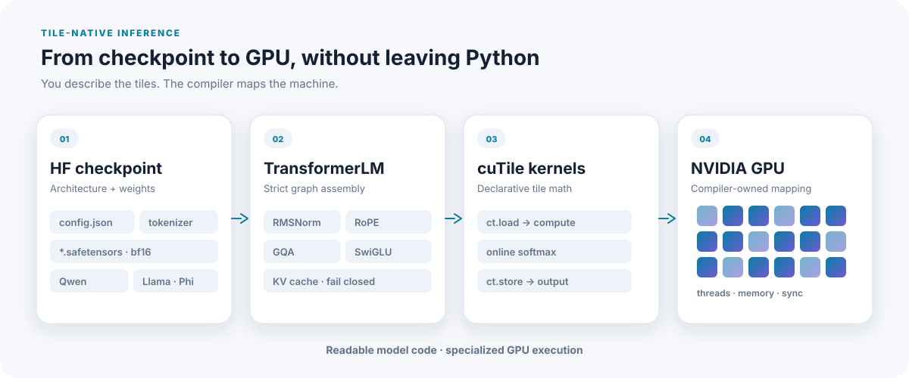
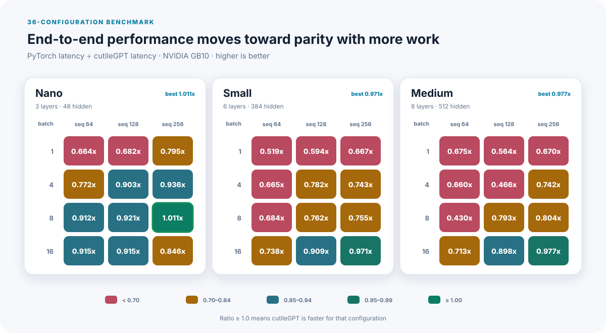

<h1 align="center">cutileGPT</h1>

<p align="center"><strong>Modern transformer inference, expressed in tiles.</strong></p>

<p align="center">
  Readable kernels for dense decoder-only LLMs, built with
  <a href="https://github.com/NVIDIA/cutile-python">NVIDIA cuTile Python</a>.
</p>

<p align="center">
  <a href="https://github.com/falcons-eyes/cutileGPT/actions/workflows/ci.yml"></a>
  <a href="https://pypi.org/project/cutile-gpt/"></a>
  <a href="https://www.python.org/"></a>
  <a href="https://developer.nvidia.com/cuda-toolkit"></a>
  <a href="LICENSE"></a>
</p>

<p align="center">
  <a href="#why-cutilegpt">Why cutileGPT</a> ·
  <a href="#benchmarks">Benchmarks</a> ·
  <a href="#quick-start">Quick start</a> ·
  <a href="#model-support">Model support</a>
</p>

---

cutileGPT is a compact inference implementation for studying how modern
transformers map onto tile-native GPU kernels. The model stays in Python; the
cuTile compiler handles thread mapping, memory movement, and synchronization.

| **7.95x** | **1.011x** | **6 verified / 12 loadable** |
|:---:|:---:|:---:|
| GELU vs CuPy | best end-to-end ratio vs PyTorch | open-weight checkpoints |

> [!NOTE]
> This is an experimental, single-GPU inference project—not a training or
> distributed serving framework.

## Why cutileGPT

<picture>
  <source media="(prefers-color-scheme: dark)" srcset="docs/assets/readme/tile-pipeline-dark.svg">
  
</picture>

Most CUDA implementations describe *how* threads cooperate. cuTile kernels
describe *what* a tile computes:

```python
@ct.kernel
def rms_norm_kernel(X, W, Y, eps, N: ConstInt, TILE_N: ConstInt):
    row = ct.bid(0)
    x = ct.load(X, index=(row, 0), shape=(1, TILE_N))
    w = ct.load(W, index=(0,), shape=(TILE_N,))
    rstd = 1 / ct.sqrt(ct.sum(x * x, axis=1) / N + eps)
    ct.store(Y, index=(row, 0), tile=(x * rstd * w).astype(Y.dtype))
```

<sub>Shortened for clarity. See the full [RMSNorm kernel](cutile_gpt/kernels/rmsnorm.py).</sub>

That same style covers the primitives used by current dense decoder models:

| Model primitive | cutileGPT implementation |
|---|---|
| RMSNorm | fp32 accumulation, Gemma unit-offset support |
| RoPE | Hugging Face layout, Llama 3 scaling, cached offsets |
| MHA / GQA | online softmax with shared KV heads |
| Sliding-window attention | skips KV tiles outside the window |
| SwiGLU | fused gated MLP path |
| Autoregressive decoding | per-layer KV cache |
| Checkpoint loading | `config.json` + safetensors, bf16 preserved through DLPack |

The loader is intentionally strict. If a checkpoint asks for arithmetic the
kernels do not implement, it raises an error instead of producing plausible but
incorrect tokens.

## Benchmarks

<picture>
  <source media="(prefers-color-scheme: dark)" srcset="docs/assets/readme/benchmark-overview-dark.svg">
  
</picture>

### End-to-end forward pass

Representative results from the checked-in 36-configuration benchmark on an
**NVIDIA GB10**. Ratio is `PyTorch latency / cutileGPT latency`; higher is
better for cutileGPT.

| Model | Batch × sequence | PyTorch | cutileGPT | Ratio |
|---|---:|---:|---:|---:|
| Nano · 3L / 48d | 1 × 64 | **0.65 ms** | 0.99 ms | 0.664x |
| Nano · 3L / 48d | 8 × 256 | 4.92 ms | **4.86 ms** | **1.011x** |
| Small · 6L / 384d | 16 × 256 | **69.90 ms** | 71.97 ms | 0.971x |
| Medium · 8L / 512d | 16 × 256 | **111.04 ms** | 113.61 ms | 0.977x |

Small workloads favor PyTorch because launch overhead dominates. As batch and
sequence length grow, the checked-in results approach parity. These numbers are
from one GPU and should be treated as a reproducible baseline, not a universal
hardware claim.

### Kernel microbenchmark

| Kernel | Shape / dtype | Reference | cuTile | Speedup |
|---|---|---:|---:|---:|
| GELU | `32 × 512 × 768`, fp32 | CuPy · 4.314 ms | **0.543 ms** | **7.95x** |

<details>
<summary><strong>Methodology, raw data, and all 36 configurations</strong></summary>

The end-to-end benchmark compares the same minGPT weights and inputs, with 5
warm-up passes and 30 synchronized timed passes per configuration. It covers 3
model sizes, 4 batch sizes, and 3 sequence lengths. The GELU microbenchmark
uses 3 warm-up passes and 10 timed passes.

- [Raw results · JSON](docs/assets/comprehensive_comparison.json)
- [Raw results · CSV](docs/assets/comprehensive_comparison.csv)
- [Full Markdown table](docs/assets/comparison_table.md)
- [Benchmark script](scripts/comprehensive_comparison.py)
- [README visual generator](scripts/create_readme_visuals.py)

Reproduce the full comparison from a source checkout:

```bash
uv run python scripts/comprehensive_comparison.py
uv run python scripts/create_readme_visuals.py
```

</details>

## Quick start

### Requirements

- Python 3.13+
- NVIDIA driver r580+
- CUDA Toolkit 13.1+
- A GPU supported by the installed `tileiras` compiler

The project is developed and benchmarked on Blackwell GB10. GPU support changes
with cuTile releases, so check the
[upstream system requirements](https://github.com/NVIDIA/cutile-python#system-requirements)
before installing on another architecture.

### Install

```bash
pip install "cutile-gpt[hf,torch]"
```

The base package is enough for direct kernel use. The `hf` and `torch` extras
are used below to download and load safetensors checkpoints.

### Run a Hugging Face checkpoint

```python
import cupy as cp
from huggingface_hub import snapshot_download
from transformers import AutoTokenizer

from cutile_gpt.models.transformer import TransformerLM

model_id = "Qwen/Qwen3-0.6B"
path = snapshot_download(model_id)

tokenizer = AutoTokenizer.from_pretrained(path)
model = TransformerLM.from_pretrained(path)

prompt = "The future of GPU programming is"
token_ids = tokenizer(prompt, return_tensors="np").input_ids
token_ids = cp.asarray(token_ids, dtype=cp.int32)

logits = model.forward(token_ids)
next_id = int(cp.argmax(logits[0, -1]).get())
print(tokenizer.decode([next_id]))
```

`TransformerLM` reads the checkpoint configuration instead of hardcoding a
single architecture. Weights remain in their source dtype, including bf16.

### Use the kernels directly

```python
import cupy as cp
from cutile_gpt import cutile_rms_norm

x = cp.random.standard_normal((8, 128, 1024), dtype=cp.float32)
weight = cp.ones(1024, dtype=cp.float32)
y = cutile_rms_norm(x, weight, eps=1e-6)
```

### Install from source

```bash
git clone --recursive https://github.com/falcons-eyes/cutileGPT.git
cd cutileGPT
uv sync --all-extras

# Compare a real checkpoint against transformers.
uv run python scripts/verify_model.py Qwen/Qwen3-0.6B
```

## Model support

The current loader targets **dense, decoder-only, RoPE + RMSNorm + gated-MLP**
architectures.

| Family | Verified checkpoint | Result |
|---|---|---|
| Qwen3 | `Qwen/Qwen3-0.6B` | bf16 argmax agreement + generation |
| Qwen3 | `Qwen/Qwen3-Reranker-0.6B` | bf16 argmax agreement |
| Qwen2 | `Qwen/Qwen2.5-0.5B-Instruct` | bf16 argmax agreement; QKV bias path |
| Phi | `microsoft/Phi-3-mini-4k-instruct` | bf16 argmax agreement; fused projections |
| Llama | `unsloth/Llama-3.2-1B-Instruct` | fp32 argmax agreement |
| SmolLM2 | `HuggingFaceTB/SmolLM2-360M-Instruct` | bf16 argmax agreement |

Twelve surveyed checkpoints currently load, including larger Qwen3, Phi-4,
Mistral, Yi, and Muse Glimmer variants. See the generated
[model compatibility matrix](docs/MODELS.md) for exact shapes, validation
notes, and refusal reasons.

Not implemented yet: MoE routing, Mamba/state-space layers, pre-quantized
weights, partial rotary embeddings, and architectures with per-layer-type
head shapes.

## Development

```bash
uvx ruff check .
uv lock --check
uv build
uv run pytest
```

GPU kernel tests require compatible NVIDIA hardware; packaging and import
checks run without a GPU. Benchmark results from other GPUs are especially
welcome—see [CONTRIBUTING.md](CONTRIBUTING.md).

## Acknowledgements

Built on [NVIDIA cuTile Python](https://github.com/NVIDIA/cutile-python), with
correctness references from [PyTorch](https://pytorch.org/),
[Transformers](https://github.com/huggingface/transformers), and
[minGPT](https://github.com/karpathy/minGPT).

## License

[Apache-2.0](LICENSE)
